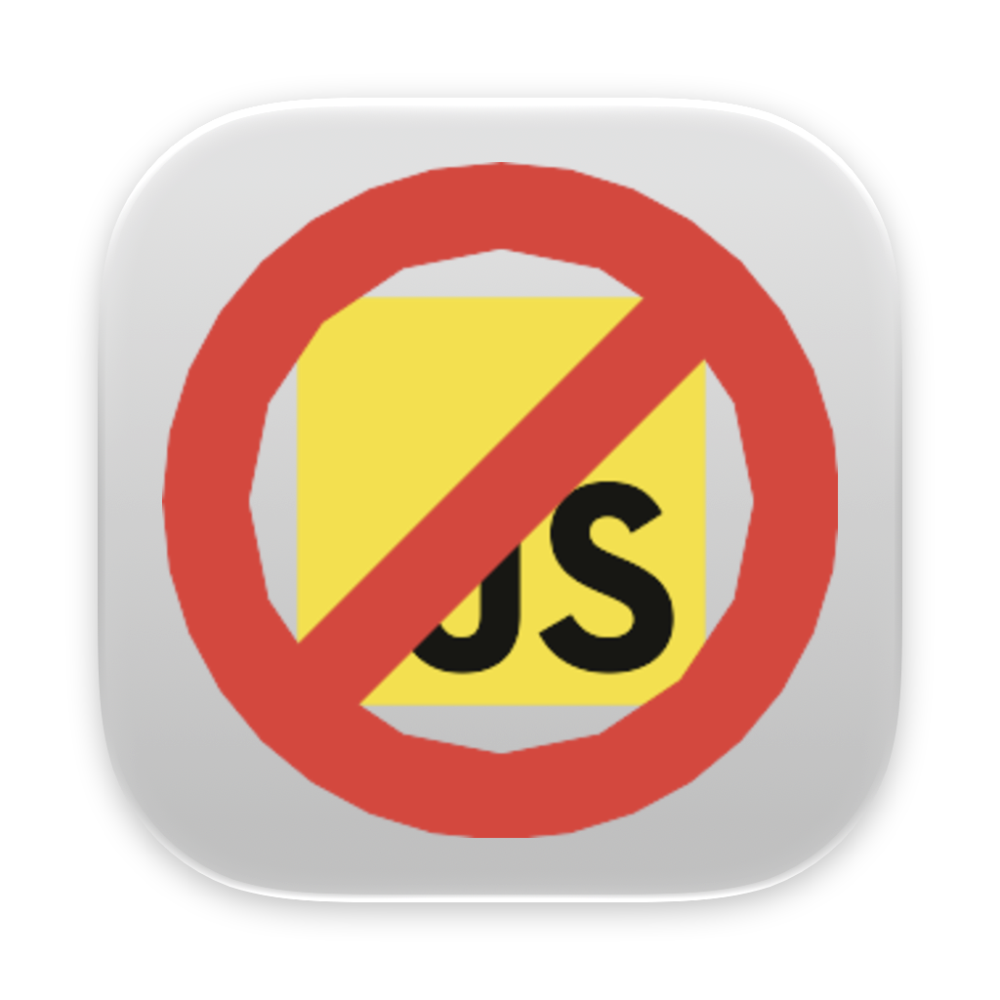

#  NoJS

NoJS is a Safari Web Extension for quickly disabling JavaScript on individual websites. Click its toolbar icon to toggle JavaScript for the current domain; NoJS remembers the choice and reloads the page automatically.

## Features

- One-click JavaScript toggle for the current domain
- Persistent per-domain settings
- Automatic page reload after each change
- Toolbar badge when JavaScript is disabled
- Native Safari Web Extension for macOS and iOS
- No frontend framework or third-party runtime dependencies

## Requirements

- Xcode 27 or later
- A macOS or iOS development signing team for running on a device
- Safari website access for the domains where NoJS is used

## Building

1. Open `NoJS.xcodeproj` in Xcode.
2. Select the `NoJS (macOS)` scheme.
3. Configure signing for both the app and extension targets.
4. Build and run the app.
5. Enable NoJS in Safari's extension settings and grant website access.

The repository also contains a macOS GitHub Actions workflow. It runs nightly and can be started manually from the Actions tab. CI artifacts are unsigned development builds.

## License

NoJS is available under the [MIT License](LICENSE).
